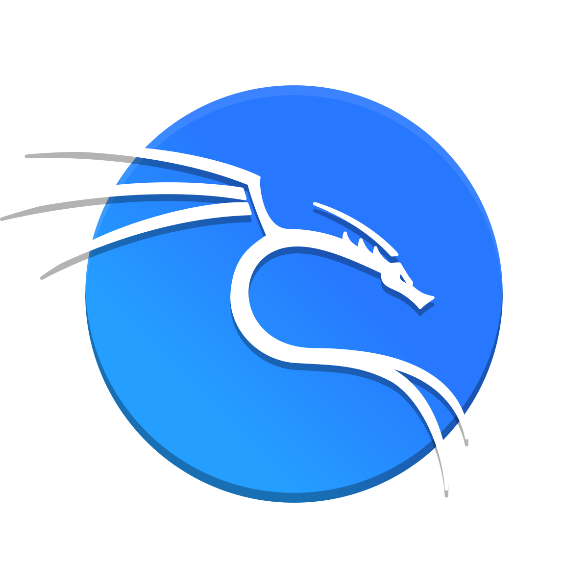

<h1 align="center">
   
  
  
   
  Bachelor Thesis - <u>OT Security</u> - Rémi Heredero
   
</h1>

This repo hosts my Bachelor's thesis about OT Security.

# Table of contents

<a href="#content-of-the-thesis">Content of the Thesis</a> • 
<a href="#abstract">Abstract</a> • 
<a href="#credits">Credits</a> • 
<a href="#stack">Stack</a> • 
<a href="#license">License</a>

## Content of the Thesis

[(Back to top)](#table-of-contents)

- Impact on Sustainability
- Analysis
  - Attacks (Sniffing, Spoofing, Denial of Service, Replay, Man in the Middle)
  - Communication media (Modbus, wireless M-bus)
  - Simulation environments (Factory I/O, Home I/O, Minecraft)
- Attack by Man in the Middle
- Attack by Replay
- Attack by Denial of Service

### Man in the Middle attack
Main repo for this part are: 
- [Modbus interface for HomeIO simulation](https://github.com/Klagarge/Modbus2HomeIO)
- [Controller for HomeIO simulation](https://github.com/Klagarge/ControllerHomeIo)
- [MitM on Modbus/TCP](https://github.com/Klagarge/MitM-TCP-HomeIO)
- [MitM on Modbus/TLS without certificat verification](https://github.com/Klagarge/MitM-TLS-HomeIO)

### Replay attack

### DoS attack

## Abstract

[(Back to top)](#table-of-contents)

## Credits

[(Back to top)](#table-of-contents)

* [Rémi Heredero](https://github.com/Klagarge) for the Thesis
* [Yann Sierro](https://github.com/Fastium), [Louis Heredero](https://github.com/LordBaryhobal) for proofreading
* [Silvan Zahno](https://github.com/tschinz) and all guys from [Typst](https://github.com/typst/typst) for the Typst template

## Stack

[(Back to top)](#table-of-contents)

For go programmation a nice startup is what made [cm0x4D](https://github.com/cm0x4D) for [HEI Synd IIot security course](https://github.com/hei-synd-iiot/golang). You can find it on [https://hei-synd-iiot.github.io/golang/](https://hei-synd-iiot.github.io/golang/)

## License

[(Back to top)](#table-of-contents)

* The Typst template used is on MIT license.
* Some Typst module are under Apache 2.0 or GPL 3.0
* The content of this Thesis is under GPL 3.0